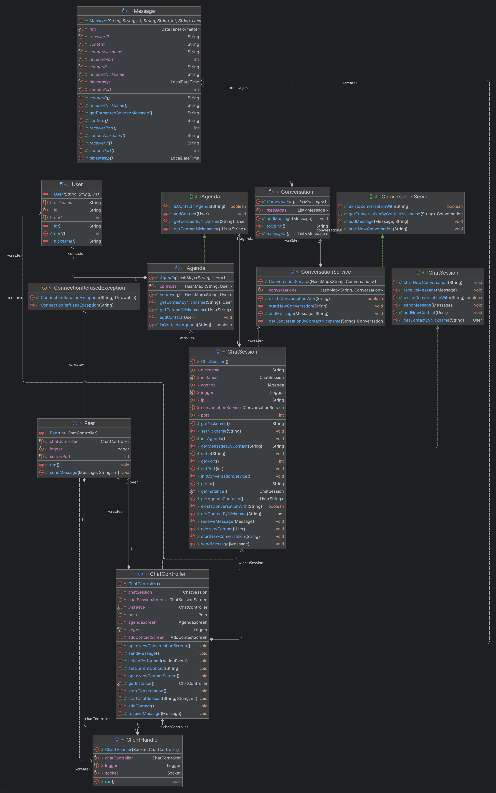

# Sistema Mensajeria

### Features

- Peer to Peer Architecture
- [App Diagrams](https://drive.google.com/file/d/19DERCeiYNoHxB71BAmzBTMEv9z1fw0Yx/view?usp=sharing)
    - Diagrama de casos de uso
    - Modelo de dominio
    - Diagrama de clases
    - Diagrama de componentes
    - Diagrama de despliegue

### Class Diagram

### Todo

- [x] Agregar pop up de mensaje no enviado por destinatatio desconectado
- [ ] Mejor visibilidad del nombre de usuario
- [x] Modificar caso de uso recibir mensaje por leer mensaje
- [ ] Agregar docker
